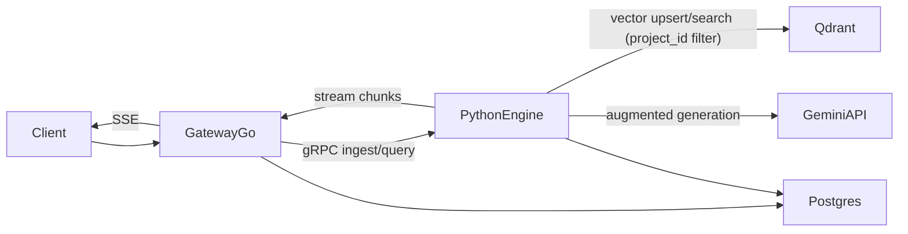

# Architecture

## High-level Components
- Gateway Service (Go): auth API key, quota, rate-limit, SSE fan-out.
- AI Engine (Python): ingest, retrieval, generation, stream chunks.
- PostgreSQL: `projects`, `api_keys`, `documents`.
- Qdrant: collection `rag_embeddings` với payload có `project_id`.

## Sequence Flow
1. Client -> Go Gateway (Auth Check).
2. Go Gateway -> Python Engine (Parse File/Query).
3. Python Engine -> Qdrant (Vector Search).
4. Python Engine -> Gemini API (Augmented Generation).
5. Python Engine --(Stream)--> Go Gateway --(SSE)--> Client.

## Mermaid Flow

## Multi-tenancy Invariants
- Mọi request phải resolve được `project_id`.
- Mọi query vector bắt buộc filter payload theo `project_id`.
- Không trả dữ liệu chéo tenant dù cùng query.
